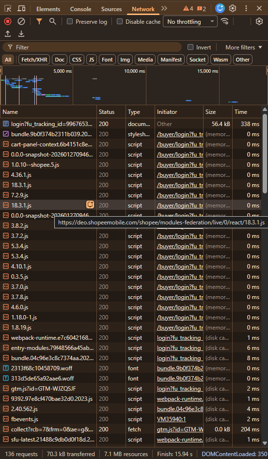
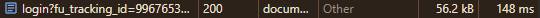
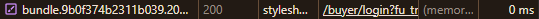
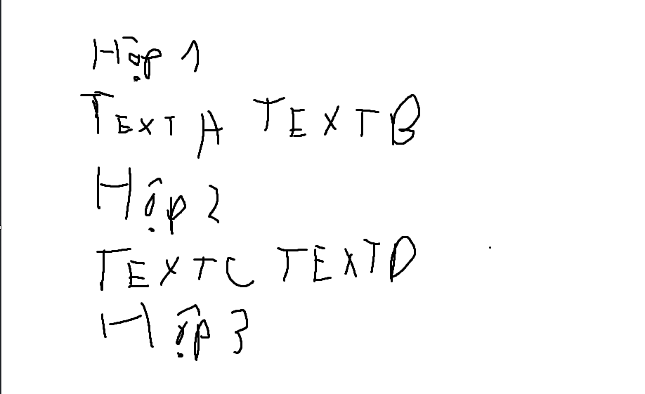

# Phần A

## Câu A1

### 1. Hành trình của một Request
Trong 0.3 giây tiếp theo, điều kỳ diệu xảy ra:

* **Bước 1:** Request xuất phát từ laptop → đi qua router WiFi nhà trọ.
* **Bước 2:** Qua nhà mạng VNPT → chạy xuyên cáp quang dưới đáy Thái Bình Dương.
* **Bước 3:** Đến data center của Shopee.
* **Server xử lý:** "Minh muốn xem News Feed".
* **Bước 4 (Response):** Response chạy ngược lại: cáp quang → VNPT → router → laptop.
* **Bước 5:** Chrome nhận file HTML, CSS, JS → render ra giao diện → Minh thấy News Feed.

> *0.3 giây. 13.000 km. Hàng triệu phép tính. Và tất cả bắt đầu bằng ba chữ cái: **H. T. M. L.***
*(Nguồn: File tuan1_html5, chương 01, phần đầu tiên)*

### 2. Phân tích tiến trình tải trang
Công cụ này cho biết trang web đang tải những gì, mất bao lâu và dữ liệu nào đang được gửi đi hoặc nhận về.



* **Status Code của request đầu tiên là:** 
* **Tổng thời gian load trang là:** 
* **Một request trả về file CSS là:** 

---

## Câu A2

Sau khi đọc chương 4, em thấy trang web trên bị Google đánh giá SEO thấp vì dùng quá nhiều thẻ `<div>` (thẻ non-semantic). Dưới đây là 4 lỗi semantic và cách sửa lại:

1.  **Cấu trúc trang:** Thay vì dùng `<div class="header">`, `<div class="main">` và `<div class="footer">`, ta nên dùng các thẻ chuẩn HTML5 là `<header>`, `<main>` và `<footer>`.
2.  **Thanh điều hướng:** Thiếu thẻ `<nav>` và danh sách `<ul>`, `<li>`. 
    * **Sửa lại:**
        ```html
        <nav>
            <ul>
                <li><a href="/">Trang chủ</a></li>
                <li><a href="/products">Sản phẩm</a></li>
            </ul>
        </nav>
        ```
3.  **Thẻ tiêu đề (Heading):** Tên sản phẩm đang bị bọc trong thẻ div vô nghĩa `<div class="title">`. Ta cần dùng thẻ heading để máy tìm kiếm hiểu được trọng tâm.
    * **Sửa lại:** `<h1 class="title">iPhone 16 Pro</h1>`
4.  **Khối nội dung:** Không dùng thẻ `<article>`. Nên thay `<div class="product">` bằng `<article>` để giữ tính nguyên khôi và độc lập của khối thông tin sản phẩm.

*(Nguồn: tuan_1_html5, chương 4 phần tại sao lại không dùng div)*

---

## Câu A3



* **Thẻ Block:** `<div>` hộp 1, hộp 2, hộp 3 là các thẻ block nên chúng sẽ chiếm trọn một dòng.
* **Thẻ Inline:** * `<span>Text A</span>` và `<span>Text B</span>` là thẻ inline nên sẽ đi liền nhau trên một hàng. Tuy nhiên, vì thẻ block trước đó đã chiếm trọn dòng 1 nên chúng sẽ tự động xuống dòng 2.
    * `<span>Text C</span>` và `<strong>Text D</strong>` tương tự như A và B, nhưng thẻ `<strong>` (Text D) sẽ được hiển thị in đậm.

---

## Câu A4

### Sự khác biệt giữa các thành phần bảng:
* `<thead>`: Phần đầu của bảng (chứa tiêu đề cột).
* `<tbody>`: Phần thân của bảng (chứa dữ liệu chính).
* `<tfoot>`: Phần chân của bảng (chứa tổng kết hoặc ghi chú).

### Tại sao không nên dùng Table để tạo Layout trang web?
1.  **Sai ngữ nghĩa (Semantic):** Gây ảnh hưởng xấu đến khả năng đọc hiểu của máy tìm kiếm (SEO).
2.  **Kém linh hoạt:** Khó tùy biến giao diện đáp ứng (Responsive) trên các thiết bị di động.
3.  **Hiệu suất:** Tốc độ render của trình duyệt chậm hơn so với sử dụng CSS hiện đại (Flexbox/Grid).

*(Nguồn: tuan_1_html5, chương 5, phần bảng dữ liệu)*

## Phần B

### Câu B3: Debug HTML

* **Lỗi 1 (Dòng 1):** Khai báo DOCTYPE sai cú pháp — Sửa `<!DOCTYPE>` thành `<!DOCTYPE html>`.
* **Lỗi 2 (Dòng 2):** Thiếu thẻ đóng của tiêu đề trang — Thêm `</title>` vào cuối dòng.
* **Lỗi 3 (Dòng 3):** Giá trị charset viết sai chuẩn — Sửa `utf8` thành `UTF-8` (hoặc `utf-8`).
* **Lỗi 4 (Dòng 4):** Thẻ đóng của tiêu đề H1 bị sai cú pháp (thiếu dấu `/`) — Sửa `<h1>` ở cuối thành `</h1>`.
* **Lỗi 5 (Dòng 4 & Dòng 6):** Lỗi Semantic: Tiêu đề chính `<h1>` đang nằm ngoài phần `<header>` — Di chuyển thẻ `<h1>` vào bên trong thẻ `<header>`.
* **Lỗi 6 (Dòng 8):** Thẻ đóng của link bị sai cú pháp — Sửa `<a>` ở cuối thành `</a>`.
* **Lỗi 7 (Dòng 15 & Dòng 22):** Lỗi Semantic: Bỏ qua cấp độ tiêu đề (nhảy cóc từ H1 xuống thẳng H3) — Sửa các thẻ `<h3>` thành `<h2>`.
* **Lỗi 8 (Dòng 16):** Thuộc tính `src` thiếu dấu ngoặc kép và thẻ `` thiếu thuộc tính `alt` (bắt buộc trong HTML5) — Sửa thành ``.
* **Lỗi 9 (Dòng 18):** Lỗi chéo thẻ (Nesting error): Thẻ `<b>` mở bên trong `<p>` nhưng lại đóng bên ngoài `<p>` — Sửa trật tự đóng thẻ thành `<p>Giá: <strong>25.990.000đ</strong></p>`.
* **Lỗi 10 (Dòng 41):** Thiếu thẻ đóng của đoạn văn bản — Thêm `</p>` vào cuối câu.

---

### Câu B4: Phân tích trang shopee.vn

#### 1. 3 thẻ semantic HTML5 mà trang sử dụng đúng:
* `<header>`: Phần header trên cùng chứa logo, thanh tìm kiếm, giỏ hàng.
* `<section>`: Dùng để nhóm các khối nội dung theo chủ đề (Ví dụ: khối Flash Sale, khối Sản phẩm hot, Gợi ý hôm nay…).
* `<footer>`: Phần chân trang nằm dưới cùng chứa thông tin công ty, hỗ trợ khách hàng, chính sách.

#### 2. Phân tích thẻ `<table>` trên trang:
* **Vị trí tìm thấy:** Nằm trong phần "Mô tả sản phẩm" của một trang chi tiết áo thun/giày dép.
* **Nội dung hiển thị:** Table này hiển thị bảng quy đổi kích cỡ (Size chart) để khách hàng chọn size áo/quần phù hợp.
* **Cấu trúc:** Table này thường bị thiếu thẻ ngữ nghĩa, người bán có dùng `<tbody>` nhưng lại KHÔNG dùng `<thead>`. Các hàng tiêu đề chỉ dùng thẻ `<tr>` và `<td>` (thay vì `<th>`) nằm chung trong phần thân bảng.

#### 3. Phân tích thẻ `<form>` trên trang:
* **Vị trí tìm thấy:** Form đăng nhập hệ thống của Shopee.
* **Action và Method:** Thẻ form này không khai báo trực tiếp thuộc tính `action` và `method` trên HTML. Vì Shopee là dạng trang web Single Page Application, dữ liệu form được chặn lại và gửi đi ngầm thông qua JavaScript (gọi API).
* **Input types được sử dụng:**
    * `<input type="text">`: Dành cho ô nhập Tên đăng nhập / Email / Số điện thoại.
    * `<input type="password">`: Dành cho ô nhập Mật khẩu để bảo mật ký tự.

## Phần C

### Câu C1

```html
<!DOCTYPE html>
<html lang="en">
<head>
  <meta charset="UTF-8">
  <meta name="viewport" content="width=device-width, initial-scale=1.0">
  <title>Chi tiết sản phẩm</title>
</head>
<body>
  <header>
    <h1>Logo Brand</h1>
    <nav>
            <ul>
                <li><a href="#">Trang chủ</a></li>
                <li><a href="#">Sản phẩm</a></li>
            </ul>
        </nav>
  </header>

   <main>
    <nav aria-label="breadcrumb">
        <ol>
            <li><a href="/">Trang chủ</a></li>
            <li><a href="/mobile">Điện thoại</a></li>
            <li aria-current="page">iPhone 16</li>
        </ol>
    </nav>

    <article itemscope itemtype="[https://schema.org/Product](https://schema.org/Product)">
        <section id="product-overview">
            <figure>
                <div class="main-image">
                    
                </div>
                <ul class="thumbnail-list">
                    <li></li>
                    <li></li>
                    <li></li>
                    <li></li>
                    <li></li>
                </ul>
            </figure>

            <div class="product-info">
                <h1 itemprop="name">iPhone 16 - 128GB - Chính hãng VN/A</h1>
                
                <p class="price">
                    Giá: <span>22.990.000đ</span>
                </p>

                <div class="rating">
                    <span>4.5/5 sao</span>
                </div>

                <section class="description">
                    <h2>Mô tả sản phẩm</h2>
                    <p>iPhone 16 với chip A18 mạnh mẽ, camera cải tiến...</p>
                </section>
            </div>
        </section>

        <section id="specifications">
            <h2>Thông số kỹ thuật</h2>
            <table>
                <thead> <tr>
                      <th>Màn hình</th>
                      <th>Chipset</th>
                  </tr>
                </thead>
                <tbody> <tr>
                    <td>6.1 inch, Super Retina XDR</td>
                    <td>Apple A18</td>
                  </tr>
                </tbody>
            </table>
        </section>

        <section id="reviews">
            <h2>Đánh giá từ khách hàng</h2>
            <article class="comment">
                <footer>Nguyễn Văn A - <time datetime="2024-10-20">20/10/2024</time></footer>
                <p>Máy rất đẹp, giao hàng nhanh!</p>
            </article>
        </section>
    </article>

    <aside>
        <h3>Sản phẩm tương tự</h3>
        <ul>
            <li><a href="#">iPhone 16 Pro</a></li>
            <li><a href="#">iPhone 15</a></li>
        </ul>
    </aside>
  </main>

  <footer>
      <p>&copy; 2024 Ecommerce Store</p>
  </footer>
</body>
</html>

### Câu C2

Tôi thấy quan điểm “cứ dùng `<div>` cho mọi thứ rồi thêm class” nghe có vẻ tiện nhưng mà nếu ta dùng lâu dài thì nó sẽ gây hại nhiều hơn là lợi.

* **Về SEO:** Các công cụ tìm kếm như là Bing, Google không chỉ đọc class, mà còn dựa vào cấu trúc semantic để hiểu nội dung trang. Việc dùng `<header>`, `<main>`, `<article>`, `<section>`, `<nav>` giúp bot xác định đâu là nội dung chính, đâu là điều hướng, đâu là bài viết độc lập. Nếu mọi thứ đều là `<div>`, cấu trúc tài liệu trở nên “phẳng”, khó phân tích ngữ nghĩa và có thể ảnh hưởng đến thứ hạng tìm kiếm.
* **Về Accessibility:** rình đọc màn hình (screen reader) cho người khiếm thị dựa vào thẻ semantic để điều hướng nhanh. Ví dụ, người dùng có thể nhảy trực tiếp tới `<nav>` hoặc `<main>` mà không phải nghe toàn bộ trang. Nếu chỉ dùng `<div>`, bạn phải bổ sung rất nhiều ARIA role, vừa phức tạp vừa dễ sai sót.
* **Ví dụ cụ thể:** một trang blog dùng `<article>` cho từng bài viết và `<aside>` cho phần bài liên quan.

Tuy nhiên, `<div>` vẫn hoàn toàn phù hợp khi chỉ cần một container thuần túy để layout hoặc styling, ví dụ bọc một nhóm phần tử để áp dụng flexbox hoặc grid mà không mang ý nghĩa nội dung riêng.